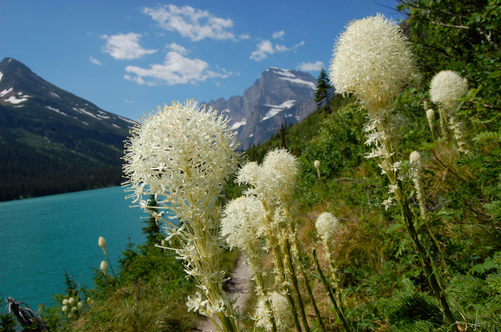

I am an environmental and natural resource economist and Fellow at [Resources for the Future](https://www.rff.org/).
My research interests center on forest and land management policy, and particularly on various
issues related to wildfire management, a topic I began studying prior to graduate school while
working with the US Forest Service in Missoula, Montana.

My Ph.D. in economics is from [University of California, Santa Barbara](https://econ.ucsb.edu/). In my dissertation, 
I studied government fire
manager decision-making  with respect to fire suppression and fuel treatment locations, and
the role of manager preferences and behavioral biases in determining efficiency and equity
of management decisions.

My recent work includes research on outdoor recreation, wildfire risk in the wildland-urban
interface, and land use conversions.

In my early twenties, I spent a few summers working for the National Park Service in Glacier
National Park. Some of the photos on this site are from the time I spent there.

{:class="img-responsive align-right"}
